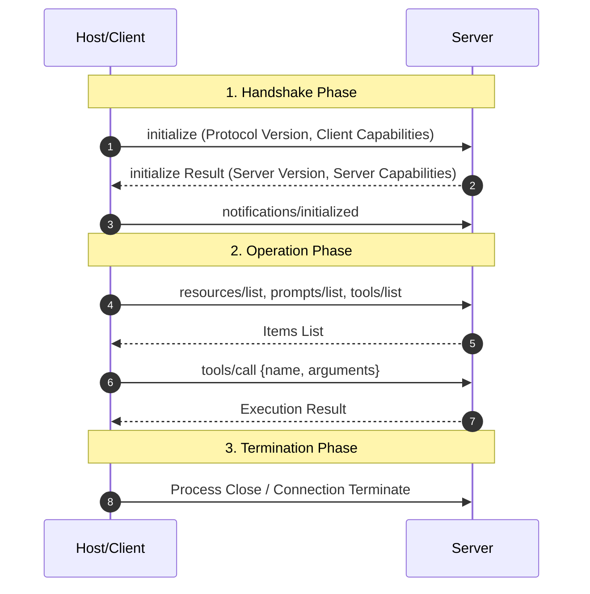

# Catatan 01: Overview & Arsitektur Model Context Protocol (MCP)

## 1. Latar Belakang & Masalah Sebelum Adanya MCP

Sebelum hadirnya Model Context Protocol (MCP), menghubungkan Large Language Model (LLM) ke berbagai data source dan tools internal perusahaan dilakukan secara ad-hoc:
- Setiap aplikasi LLM (Claude Desktop, ChatGPT, IDE, Custom Agent) harus membuat skema integrasi khusus untuk setiap database, API, atau sistem file.
- Terjadi masalah **N x M Integrations**: Jika terdapat $N$ aplikasi LLM dan $M$ sumber data/tools, maka dibutuhkan $N \times M$ kode integrasi khusus.
- Format komunikasi tidak standar, sulit melakukan pengujian keamanan (security audit), dan integrasi rapuh ketika API berubah.

```
SEBELUM MCP (Integrasi N x M):
[LLM App 1] ----> Custom Connector 1 ----> [Database]
[LLM App 1] ----> Custom Connector 2 ----> [GitHub API]
[LLM App 2] ----> Custom Connector 3 ----> [Database]
[LLM App 2] ----> Custom Connector 4 ----> [Local Filesystem]

SESUDAH MCP (Integrasi Standar 1 x N):
[LLM App 1 (Host)] ---\
                      +===> [MCP Standard Protocol] ===> [MCP Server (DB / File / API)]
[LLM App 2 (Host)] ---/
```

---

## 2. Definisi Model Context Protocol (MCP)

**Model Context Protocol (MCP)** adalah standar protokol komunikasi dua arah berbasis JSON-RPC 2.0 terbuka yang dikembangkan oleh Anthropic. Protokol ini memisahkan peran antara:
1. **Aplikasi LLM (Host)** yang membutuhkan informasi/eksekusi aksi.
2. **Penyedia Data & Fungsi (Server)** yang memiliki akses ke sistem lokal atau remote.

Dengan MCP, developer hanya perlu menulis 1 MCP Server untuk sistem mereka (misal: PostgreSQL MCP Server, FileSystem MCP Server), dan server tersebut secara otomatis dapat digunakan oleh *seluruh* aplikasi LLM yang mendukung protokol MCP.

---

## 3. Spesifikasi Protokol & JSON-RPC 2.0 Framing

MCP menggunakan format **JSON-RPC 2.0** sebagai bahasa komunikasinya. Setiap pesan terdiri dari 3 jenis utama:

### A. Request (Dari Client ke Server atau sebaliknya)
```json
{
  "jsonrpc": "2.0",
  "id": 1,
  "method": "tools/call",
  "params": {
    "name": "calculate_tax",
    "arguments": {
      "income": 75000,
      "state": "CA"
    }
  }
}
```

### B. Response (Jawaban atas Request)
```json
{
  "jsonrpc": "2.0",
  "id": 1,
  "result": {
    "content": [
      {
        "type": "text",
        "text": "Estimasi pajak untuk pendapatan $75,000 di CA adalah $12,450."
      }
    ],
    "isError": false
  }
}
```

### C. Notification (Pesan 1 arah tanpa id / tidak menunggu balasan)
```json
{
  "jsonrpc": "2.0",
  "method": "notifications/resources/updated",
  "params": {
    "uri": "file:///logs/system.log"
  }
}
```

---

## 4. Lifecycle Protokol MCP

Koneksi antara MCP Client dan MCP Server mengikuti alur kehidupan (*lifecycle*) resmi:



1. **Inisialisasi (`initialize`)**: Client dan Server bertukar informasi versi protokol dan negosiasi kapabilitas (*capabilities*) seperti dukungan resources, prompts, tools, dan logging.
2. **Konfirmasi (`notifications/initialized`)**: Client mengabarkan bahwa inisialisasi telah selesai dan siap menerima pesan/operasi.
3. **Operasi Normal**: Client melakukan kueri daftar kapabilitas, membaca konten sumber data, memanggil fungsi tool, atau menerima notifikasi pembaruan data real-time.
4. **Terminasi**: Penutupan koneksi secara tertib.
