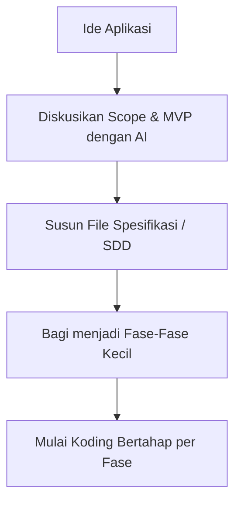

# Modul 01: Plan Before You Code

> **"AI Tools can Help with Planning"** — Sebelum menulis satu baris kode pun, gunakan AI untuk merencanakan arsitektur, mendefinisikan skope MVP, dan mendokumentasikan spesifikasi teknis.

---

## 📌 Definisi Umum
**Plan Before You Code** adalah praktik dalam Vibe Coding di mana pengembang menggunakan AI Coding Assistant sebagai mitra diskusi (sparring partner) untuk mematangkan ide, menentukan batasan Minimum Viable Product (MVP), merinci urutan pengerjaan per fase, serta menyusun spesifikasi sebelum meminta AI membuatkan kode.

Tanpa perencanaan yang matang, AI akan langsung membuat asumsi sendiri yang berisiko menghasilkan kode kompleks, tidak terstruktur, dan sulit dipelihara.

---

## 📄 Daftar Sub-Topik & Panduan Praktis

1. [📂 `01-plan-mvp-and-phases.md`](./01-plan-mvp-and-phases.md)
   - Rencanakan apa yang perlu dibuat (Scope MVP & Pentahapan Fitur).
2. [📂 `02-step-by-step-development.md`](./02-step-by-step-development.md)
   - Bekerja secara bertahap (step-by-step) alih-alih membangun semuanya sekaligus.
3. [📂 `03-illustrate-with-examples.md`](./03-illustrate-with-examples.md)
   - Memberikan ilustrasi kepada AI berupa mockup, contoh kode, atau sampel data.
4. [📂 `04-spec-driven-development.md`](./04-spec-driven-development.md)
   - Menerapkan Spec-Driven Development (SDD) dengan file dokumen spesifikasi.

---

## 🚀 Alur Kerja yang Direkomendasikan

