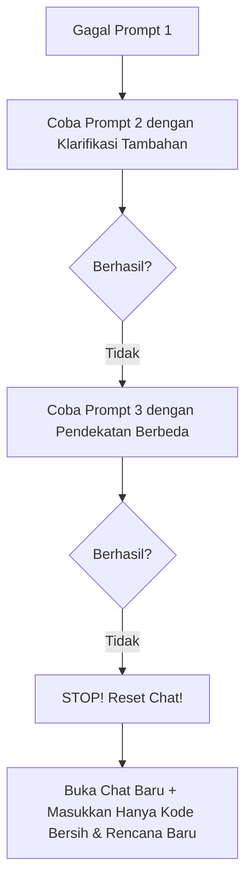

# 02 - If AI Fails After 3 Prompts, Stop and Start a Fresh Chat

## 🎯 Definisi & Konsep
**Aturan 3-Prompt (The 3-Prompt Rule)** adalah prinsip disiplin di mana jika AI gagal menyelesaikan suatu bug atau fitur setelah 3 kali iterasi prompt perbaikan, Anda **HARUS BERHENTI** berargumen dalam sesi chat tersebut, lalu membuka sesi chat baru yang bersih (*fresh chat*).

---

## 🛠️ Mengapa AI Terjebak dalam "Doom Loop"?
Ketika percakapan terlalu panjang dan berisi beberapa kesalahan beruntun dari AI, percobaan perbaikan sebelumnya yang salah masuk ke dalam riwayat konteks. AI akan cenderung mengulang atau memvariasikan kesalahan yang sama karena terpolusi oleh teks salahnya sendiri.

---

## 📋 Langkah Eksekusi Aturan 3-Prompt

### Prosedur Reset Chat Bersih:
1. Simpan atau `git checkout` perubahan terakhir yang bersih.
2. Buka chat window baru di editor/IDE.
3. Berikan instruksi baru yang jernih beserta file spesifikasi/log error terkini tanpa riwayat obrolan lama yang berantakan.
