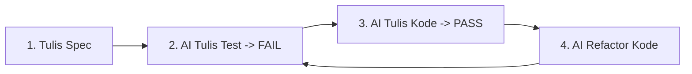

# 02 - Consider Test-Driven Development (TDD) with AI

## 🎯 Definisi & Konsep
**Test-Driven Development (TDD)** bersama AI adalah metodologi di mana Anda menginstruksikan AI untuk **menulis pengujian terlebih dahulu (Test First)** berdasarkan spesifikasi fitur, menjalankan pengujian tersebut hingga **FAIL (Merah)**, lalu meminta AI menulis kode implementasi minimum agar pengujian tersebut **PASS (Hijau)**.

---

## 🔄 Siklus Red-Green-Refactor AI



---

## 💬 Contoh Prompt TDD Workflow

**Tahap 1 (Red - Menulis Test yang Gagal)**:
```text
Kita akan menggunakan TDD untuk membuat fungsi `discountCalculator(totalAmount, couponCode)`.
Jangan buat kodenya dulu! 
Buatkan file pengujian `discountCalculator.test.ts` terlebih dahulu dengan ekspetasi:
- Diskon 'SUMMER10' memberikan potongan 10%.
- Diskon 'FLAT50' memberikan potongan Rp 50.000 jika totalAmount > Rp 200.000.
- Kupon invalid melemparkan exception 'INVALID_COUPON'.
Jalankan test dan pastikan test FAIL karena fungsinya belum ada.
```

**Tahap 2 (Green - Membuat Test Lulus)**:
```text
Sekarang buatkan file implementasi minimal `discountCalculator.ts` agar seluruh test di `discountCalculator.test.ts` menjadi PASS.
```
