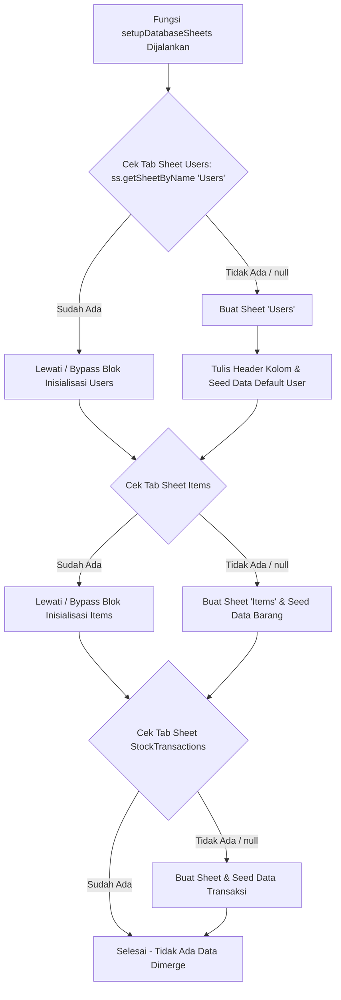

# Catatan Arsitektur: Database Setup, Seeding, & Migration Safeguard

Dokumen ini mencatat mekanisme inisialisasi database, perbedaan konsep **Database Migration vs Seeding**, serta panduan migrasi struktur data versi mendatang pada aplikasi **VibeInventory** di lingkungan Google Apps Script.

---

## 1. Ringkasan Mekanisme Seeder & Inisialisasi

Fungsi `setupDatabaseSheets()` pada [Code.gs](file:///Users/bsa/Documents/por/vibecoding/appscript-inventory/Code.gs) berfungsi untuk membuat struktur skema tabel dan mengisi data seeder awal secara otomatis jika Google Spreadsheet dalam kondisi baru / kosong.

---

## 2. Alur Pemrosesan (Logical Flow)



---

## 3. Perlindungan Terhadap Re-deploy Berulang (Data Persistence)

Pertanyaan Umum: *Apakah data seed ini akan menimpa data yang sudah ada jika aplikasi di-redeploy berulang kali?*

**Jawabannya: TIDAK.**

### Alasan Teknis:
1. **Pemeriksaan Keberadaan Sheet (`getSheetByName`)**:
   Sebelum membuat sheet atau menambah baris data, skrip selalu melakukan pengecekan:
   ```javascript
   let usersSheet = ss.getSheetByName('Users');
   if (!usersSheet) {
     // Blok ini HANYA dieksekusi 1 kali seumur hidup spreadsheet
   }
   ```
2. **Kondisi Re-deploy**:
   Saat aplikasi di-deploy ulang, di-refresh, atau dipanggil ratusan kali oleh pengguna, `ss.getSheetByName('Users')` mengembalikan objek sheet yang sudah ada (bernilai *truthy*). Akibatnya, seluruh blok pembuatan sheet dan data seed **langsung dilewati (*bypassed*) secara total**.

---

## 4. Perbedaan Konsep: Database Migration vs Database Seeding

Fungsi `setupDatabaseSheets()` menjalankan 2 peran sekaligus dalam rekayasa perangkat lunak:

| Istilah | Fungsi Utama | Implemetasi di [Code.gs](file:///Users/bsa/Documents/por/vibecoding/appscript-inventory/Code.gs) |
| :--- | :--- | :--- |
| **Schema Migration / Initialization** | Membuat **struktur/skema tabel** dan baris nama-nama kolom header (membuat rumahnya). | `usersSheet.appendRow(['user_id', 'username', 'password_hash', ...])` |
| **Database Seeding** | Mengisi **data sampel / akun awal** agar aplikasi langsung siap digunakan (penghuninya). | `usersSheet.appendRow(['USR-1001', 'admin', adminHash, ...])` |

---

## 5. Panduan Migrasi Skema di Masa Depan (Versi 2.0+)

Jika pada versi pengembangannya kelak Anda ingin menambah kolom baru (misal: kolom **`harga_beli`** pada tab `Items`), buatlah fungsi **Migration Script** khusus tanpa merusak data lama pengguna:

```javascript
function migrateDatabaseV2() {
  const ss = SpreadsheetApp.getActiveSpreadsheet();
  const itemsSheet = ss.getSheetByName('Items');
  
  if (itemsSheet) {
    // Ambil baris header ke-1
    const headers = itemsSheet.getRange(1, 1, 1, itemsSheet.getLastColumn()).getValues()[0];
    
    // Pengecekan: Jika kolom 'harga_beli' belum ada -> Tambahkan di kolom paling kanan
    if (!headers.includes('harga_beli')) {
      itemsSheet.getRange(1, headers.length + 1).setValue('harga_beli');
      Logger.log('Migrasi V2 Berhasil: Kolom harga_beli telah ditambahkan!');
    }
  }
}
```

---

## 6. Keuntungan Arsitektur "Zero-Config Onboarding"

* **Proteksi Data Pengguna**: Perubahan password, penambahan barang baru, maupun riwayat transaksi stok **dijamin 100% aman dan tidak akan pernah ter-reset atau ter-overwrite** saat skrip backend di-update atau di-deploy ulang.
* **Kemudahan Penggunaan (*Ease of Deployment*)**: Pengguna baru yang membuat salinan (*Make a Copy*) spreadsheet tidak perlu menjalankan script setup/seeder secara manual lewat editor Apps Script. Cukup buka Web App URL, dan struktur database akan siap secara otomatis pada detik pertama.
