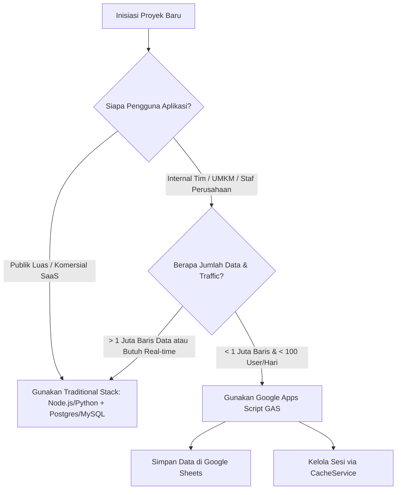

# Panduan Arsitektur: Batasan, Kuota, & Perbandingan Google Apps Script (GAS)

Dokumen ini berisi analisis lengkap mengenai **batasan teknis (*Quotas & Limits*)**, kelebihan, kekurangan, serta **panduan keputusan arsitektur** dalam menggunakan Google Apps Script dibandingkan dengan Stack Pemrograman Tradisional (Node.js/Python/Go + Database SQL/NoSQL).

---

## 1. Ringkasan Eksekutif

Google Apps Script (GAS) adalah platform **Serverless Low-Code** yang di-host penuh di atas infrastruktur Google Cloud. 

* **Kelebihan Utama**: **100% Gratis**, Nol biaya perawatan server (No Maintenance), dan terintegrasi langsung dengan ekosistem Google (Sheets, Drive, Gmail).
* **Kekurangan Utama**: Dibatasi oleh kuota eksekusi Google, kapasitas Google Sheets yang terbatas, dan tidak mendukung lalu lintas data sangat tinggi (*High Traffic*) atau fitur *Real-time* (WebSocket).

---

## 2. Rincian Batasan & Kuota Resmi Google Apps Script

Google menerapkan kuota harian dan batasan eksekusi untuk menjaga stabilitas infrastruktur mereka:

### 2.1. Batasan Database (Google Sheets as Database)
| Parameter | Batasan Akun Gratis | Batasan Google Workspace | Dampak pada Aplikasi |
| :--- | :--- | :--- | :--- |
| **Maksimal Sel per File Sheet** | 10.000.000 sel | 10.000.000 sel | Misal tabel 10 kolom, maksimal ~1 juta baris data. |
| **Waktu Baca/Tulis Data** | ~500ms - 3.000ms | ~500ms - 2.000ms | Jauh lebih lambat dari SQL Database (milidetik). |
| **Lock Service Wait Time** | 30 detik | 30 detik | Jika antrean penulisan terlalu padat, request akan error timeout. |

### 2.2. Batasan Eksekusi Skrip & Performa
| Parameter | Akun Google Gratis (@gmail.com) | Akun Google Workspace | Dampak |
| :--- | :--- | :--- | :--- |
| **Execution Time Limit** | **6 Menit / eksekusi** | **30 Menit / eksekusi** | Skrip berhenti paksa jika komputasi > 6 menit. |
| **Simultaneous Executions** | **30 Eksekusi Simultan** | **30 Eksekusi Simultan** | Maksimal ~30 request yang diproses di detik yang sama. |
| **CacheService Entry Size** | 100 KB per Key | 100 KB per Key | Nilai cache tidak bisa menyimpan JSON berukuran raksasa. |
| **CacheService Expiration** | Maksimal 6 Jam (21.600 dtk) | Maksimal 6 Jam (21.600 dtk) | Sesi aktif di server otomatis hilang setelah 6 jam. |

### 2.3. Batasan Layanan Integrasi (Email & External API)
| Layanan | Akun Google Gratis | Akun Google Workspace |
| :--- | :--- | :--- |
| **Kirim Email (`MailApp`)** | 100 email / hari | 1.500 email / hari |
| **HTTP Request (`UrlFetchApp`)** | 20.000 calls / hari | 100.000 calls / hari |
| **Triggers Runtime** | 90 menit / hari | 6 jam / hari |

---

## 3. Matriks Perbandingan Mendalam: GAS vs Traditional Stack

| Kriteria Evaluasi | Google Apps Script (GAS) | Traditional Stack (Node.js/Python + Postgres + Cloud/VPS) |
| :--- | :--- | :--- |
| **Biaya Infrastructure** | 🟢 **100% Gratis** (Server & DB ditanggung Google) | 🔴 Berbayar ($5 – $100+/bulan untuk sewa VPS, Cloud DB, SSL) |
| **Setup & Deployment** | 🟢 **Instan / Hitungan Menit** | 🔴 Perlu konfigurasi Docker, Nginx, Linux OS, CI/CD Pipeline |
| **Kemudahan Maintenance** | 🟢 **Nol Maintenance** (Tidak ada OS patch / SSL renewal) | 🔴 Wajib di-maintain berkala (Database backup, OS security patch) |
| **Kapasitas Database** | 🟡 Terbatas (~10 juta sel per Sheet) | 🟢 Sangat Besar (Terabyte, Ratusan Juta Baris Data) |
| **Performa & Latensi** | 🟡 Sedang (1-3 detik per operasi sheet) | 🟢 Sangat Cepat (5-50 milidetik per SQL query) |
| **Toleransi Traffic** | 🟡 Puluhan hingga Ratusan Pengguna Harian | 🟢 Jutaan Pengguna Simultan (High Concurrency & Auto-scaling) |
| **Real-time WebSockets** | 🔴 **Tidak Mendukung** (Hanya HTTP Polling) | 🟢 **Sangat Mendukung** (Socket.io, WebSockets, Server-Sent Events) |

---

## 4. Panduan Keputusan Arsitektur (Architecture Decision Tree)

### ✅ Gunakan Google Apps Script (Sangat Direkomendasikan) Untuk:
1. **Aplikasi Manajemen Internal**: Sistem Inventori Stok (**VibeInventory**), Absensi Karyawan, Request Cuti, Ticketing Internal IT.
2. **Otomatisasi Alur Kerja Bisnis**: Mengisi data dari Google Form ke Sheet, membuat draf invoice PDF di Google Drive, dan mengirim konfirmasi via Email.
3. **Prototyping & MVP**: Ingin menguji ide aplikasi secara cepat tanpa modal biaya hosting.

### ⛔ Wajib Gunakan Traditional Stack (Node.js/Python + SQL/NoSQL) Untuk:
1. **Aplikasi Publik Komersial**: Platform E-commerce publik, SaaS B2C, Media Sosial, Kasir Retail Raksasa (Multi-Cabang).
2. **Kebutuhan Real-time**: Aplikasi Chatting, Live Tracking GPS, Game Online.
3. **Pemrosesan Data Raksasa**: Analisis data transaksi berukuran gigabyte/terabyte.

---

## 5. Praktik Terbaik Mengoptimalkan Performa Google Apps Script

Jika tetap menggunakan Apps Script untuk aplikasi inventori/manajemen, terapkan tips performa berikut:

1. **Gunakan Batch Operations**:
   * ❌ *Jangan*: Membaca/menulis sel satu per satu dalam perulangan `for` (`setValue()`).
   * ✅ *Gunakan*: Ambil sekaligus seluruh data ke array `getValues()` dan tulis sekaligus dengan `setValues()`.
2. **Gunakan `LockService` untuk Penulisan Konkuren**:
   * Gunakan `LockService.getScriptLock()` pada operasi penambahan/pengurangan stok untuk mencegah tabrakan data.
3. **Manfaatkan `CacheService`**:
   * Simpan data yang jarang berubah (seperti sesi login atau daftar kategori) di `CacheService` agar tidak perlu membaca Google Sheet berulang kali.
