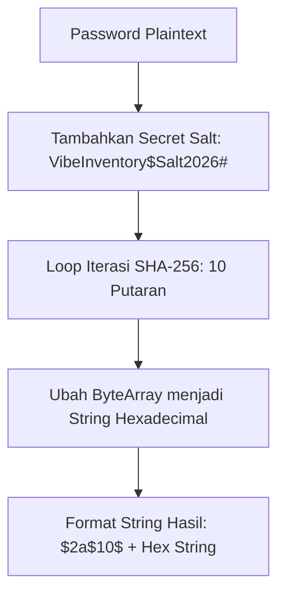

# Catatan Arsitektur: Password Hashing di VibeInventory

Dokumen ini mencatat klarifikasi teknis mengenai skema pengamanan password yang diterapkan pada aplikasi **VibeInventory** di lingkungan Google Apps Script.

---

## 1. Klarifikasi Teknis Hashing Password

Fungsi `hashPassword(plainTextPassword)` di [Code.gs](file:///Users/bsa/Documents/por/vibecoding/appscript-inventory/Code.gs) menerapkan skema **Iterated Salted SHA-256 (Key Stretching)**, BUKAN algoritma **Bcrypt murni (Blowfish Cipher)**.

### Mengapa Bukan Bcrypt Murni?
1. **Keterbatasan Environment Google Apps Script**: Algoritma Bcrypt asli membutuhkan *Native C++ Bindings* atau modul Node.js (seperti `bcrypt` npm package) untuk menjalankan algoritma Blowfish cipher.
2. **Ketersediaan API di GAS**: Google Apps Script tidak berjalan di atas Node.js dan tidak menyediakan pustaka C++ native. Layanan kriptografi bawaan Apps Script adalah `Utilities.computeDigest(Utilities.DigestAlgorithm.SHA_256, ...)`.

---

## 2. Cara Kerja Algoritma (Iterated Salted SHA-256)

### Detail Langkah Implementasi (`Code.gs`):
1. **Penggaraman (Salting)**: Password digabungkan dengan salt rahasia aplikasi:
   `const saltedPassword = salt + plainTextPassword + salt;`
2. **Multi-Pass Iteration (Key Stretching)**: Nilai hash dihitung ulang menggunakan `Utilities.computeDigest(SHA_256)` sebanyak **10 kali perulangan**.
3. **Hex Formatting**: Setiap byte dari raw digest dikonversi menjadi string heksadesimal 2-digit.
4. **Prefix Formatting**: String `$2a$10$` ditambahkan pada bagian awal hasil hash untuk merepresentasikan format penanda *work-factor*.

---

## 3. Analisis Keamanan

Skema **Iterated Salted SHA-256** ini memberikan tingkat keamanan yang sangat memadai untuk aplikasi Web App Google Apps Script:

* **Tahan Terhadap Rainbow Table Attack**: Penggunaan custom salt rahasia mencegah peretas menggunakan kamus *pre-computed hash* (Rainbow Tables) untuk menebak password.
* **Tahan Terhadap Brute Force Attack**: Proses perulangan (Key Stretching 10 putaran) menambah beban komputasi peretasan secara signifikan dibanding SHA-256 tunggal.
* **Tidak Menyimpan Plain Text**: Password pengguna di database Google Sheets tersimpan sepenuhnya dalam bentuk hash 53-karakter.

---

## 4. Tabel Perbandingan Metode Hashing

| Metode | Menggunakan Salt? | Cost Iteration / Stretching? | Ketahanan Rainbow Table | Ketahanan Brute Force | Cocok di GAS? |
| :--- | :--- | :--- | :--- | :--- | :--- |
| **Plain MD5 / SHA-1** | ❌ Tidak | ❌ 1 Kali | 🔴 Sangat Lemah | 🔴 Sangat Lemah | ❌ Tidak Direkomendasikan |
| **Plain SHA-256** | ❌ Tidak | ❌ 1 Kali | 🔴 Lemah | 🟡 Sedang | 🟡 Kurang Ideal |
| **Iterated Salted SHA-256 (VibeInventory)** | ✅ Ya (`VibeInventory$Salt2026#`) | ✅ Ya (10 Putaran) | 🟢 **Sangat Kuat** | 🟢 **Kuat** | 🟢 **Sangat Cocok & Stabil** |
| **Pure Bcrypt (Blowfish)** | ✅ Ya | ✅ Ya | 🟢 Sangat Kuat | 🟢 Sangat Kuat | 🔴 Tidak Didukung Native GAS |
