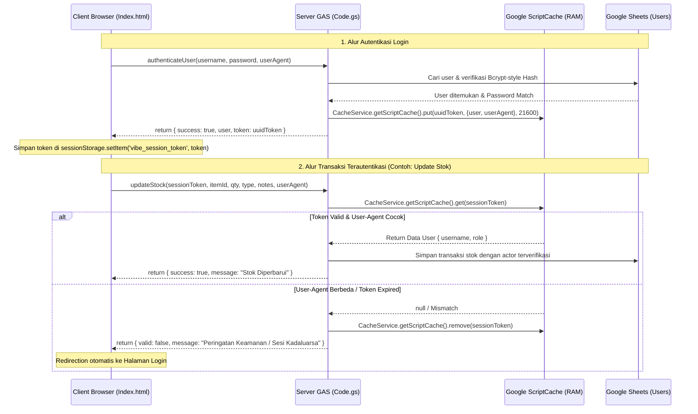

# Catatan Arsitektur: Token Sesi & Keamanan VibeInventory

Dokumen ini mencatat rancangan, alur kerja, dan alasan pemilihan teknologi untuk sistem **Token Sesi (Session Token)** pada aplikasi **VibeInventory** berbasis Google Apps Script.

---

## 1. Ringkasan Arsitektur Sesi

Sistem autentikasi VibeInventory menerapkan pola **Dual Storage Session Token** yang membagi penyimpanan menjadi dua sisi:

1. **Server Side (`Code.gs`)**:
   - **Media**: `CacheService.getScriptCache()` (RAM Key-Value Cache server Google).
   - **Isi Data**: UUID Token sebagai *Key*, dan String JSON Data User (`userId`, `username`, `fullName`, `role`, `userAgent`) sebagai *Value*.
   - **Masa Berlaku**: 6 Jam (21.600 detik). Terhapus otomatis oleh server Google jika kadaluarsa.
2. **Client Side (`Index.html`)**:
   - **Media**: `sessionStorage` browser pengguna.
   - **Isi Data**: String UUID Token (`vibe_session_token`).
   - **Masa Berlaku**: Selama tab browser aktif. Otomatis terhapus saat tab ditutup.

---

## 2. Alur Kerja (Workflow Diagram)



---

## 3. Implementasi Kode Backend (`Code.gs`)

### A. Membuat Token Sesi dengan User-Agent Binding saat Login
```javascript
function createSessionToken(user, clientUserAgent = '') {
  const token = Utilities.getUuid();
  const cache = CacheService.getScriptCache();
  const sessionData = JSON.stringify({
    userId: user.userId,
    username: user.username,
    fullName: user.fullName,
    role: user.role,
    userAgent: clientUserAgent || ''
  });
  // Simpan di cache RAM server selama 6 jam (21600 detik)
  cache.put(token, sessionData, 21600);
  return token;
}
```

### B. Memverifikasi Token Sesi, Role, dan User-Agent Perangkat
```javascript
function verifySession(sessionToken, requiredRole = null, clientUserAgent = null) {
  if (!sessionToken) {
    return { valid: false, message: 'Sesi tidak ditemukan. Silakan login kembali.' };
  }
  const cache = CacheService.getScriptCache();
  const sessionStr = cache.get(sessionToken);
  if (!sessionStr) {
    return { valid: false, message: 'Sesi telah berakhir atau tidak valid. Silakan login kembali.' };
  }
  try {
    const user = JSON.parse(sessionStr);
    if (requiredRole && user.role !== requiredRole) {
      return { valid: false, message: 'Akses ditolak: Membutuhkan hak akses ' + requiredRole + '!' };
    }
    
    // Verifikasi User-Agent Binding untuk mencegah pencurian token antar perangkat/browser berlainan
    if (clientUserAgent && user.userAgent && user.userAgent !== clientUserAgent) {
      cache.remove(sessionToken); // Hapus token berisiko
      return { valid: false, message: 'Peringatan Keamanan: Terdeteksi perubahan perangkat atau browser! Silakan login kembali.' };
    }

    return { valid: true, user: user };
  } catch (err) {
    return { valid: false, message: 'Format token sesi tidak valid.' };
  }
}
```

### C. Menghapus Token Sesi saat Logout
```javascript
function logoutUser(sessionToken) {
  if (sessionToken) {
    CacheService.getScriptCache().remove(sessionToken);
  }
  return { success: true, message: 'Berhasil keluar dari sesi.' };
}
```

---

## 4. Analisis Keamanan: Mengapa `sessionStorage` vs `Cookie`?

> **Jawaban Singkat**: Cookie biasa (JavaScript Cookie) **TIDAK LEBIH aman** dibanding `sessionStorage`. Cookie HANYA lebih aman jika berupa **`HttpOnly` Cookie**, tetapi `HttpOnly` Cookie tidak bisa dibuat di Google Apps Script.

Berikut adalah alasan teknis lengkap mengapa `sessionStorage` dipilih untuk aplikasi Google Apps Script ini:

### 4.1. Keterbatasan Arsitektur Google Apps Script (`HttpOnly` Cookie Tidak Tersedia)
Cookie baru dianggap sangat aman jika memiliki flag `HttpOnly` dan `SameSite=Strict`. Flag `HttpOnly` membuat cookie tidak bisa dibaca oleh JavaScript (mencegah pencurian token lewat serangan XSS).

* **Di Server Biasa (Node.js/PHP/Laravel)**: Server bisa mengirim Response Header HTTP:
  ```http
  Set-Cookie: session_token=xyz123; HttpOnly; Secure; SameSite=Strict
  ```
* **Di Google Apps Script (`Code.gs`)**: Google **tidak menyediakan API untuk mengatur HTTP Response Header (`Set-Cookie`)**.
* Jika kita memaksa memakai cookie di frontend via `document.cookie = ...`, cookie tersebut **bukan `HttpOnly`** (bisa dibaca oleh JavaScript biasa), sehingga level keamanannya persis sama dengan `sessionStorage`.

---

### 4.2. Keunggulan `sessionStorage` dalam Konteks Apps Script

| Kriteria Keamanan | `document.cookie` (Client) | `sessionStorage` (Dipakai Saat Ini) |
| :--- | :--- | :--- |
| **Ketahanan terhadap CSRF** | ❌ **Rentan**. Cookie ter-send otomatis oleh browser di setiap HTTP request. | ✅ **Sangat Aman**. Token TIDAK terkirim otomatis. Browser harus secara eksplisit menyertakan token saat memanggil `google.script.run`. |
| **Isolasi Memori Tab** | ❌ Terbagikan di seluruh tab browser. | ✅ **Terisolasi khusus tab aktif**. Begitu tab ditutup, token otomatis terhapus dari RAM browser. |
| **Blokir Browser (Third-Party Restrictions)** | ❌ Sering **diblokir oleh Safari/Chrome** karena Web App GAS berjalan di dalam `<iframe>` (`script.googleusercontent.com`). | ✅ **Bekerja 100% Stabil** di semua browser tanpa terpengaruh aturan Third-Party Cookie. |

---

### 4.3. Risiko Serangan & Mitigasi Aktif

1. **Serangan CSRF (Cross-Site Request Forgery)**:
   * Menggunakan `sessionStorage` membuat aplikasi ini **kebal dari serangan CSRF**, karena penyerang di web lain tidak bisa membuat browser mengirimkan token `sessionStorage` secara otomatis.
2. **Serangan XSS (Cross-Site Scripting) & Mitigasinya**:
   * **Sanitasi HTML (`escapeHtml`)**: Seluruh pencetakan teks masukan pengguna di [Index.html](file:///Users/bsa/Documents/por/vibecoding/appscript-inventory/Index.html) kini melewati fungsi `escapeHtml()` untuk menetralkan tag skrip jahat (`<script>`, `onerror`, `onload`).
   * **User-Agent Device Binding**: Setiap panggilan server memeriksa kecocokan string `navigator.userAgent`. Jika token dicuri dan digunakan dari perangkat/browser/skrip otomatis yang berbeda, server `Code.gs` akan langsung memblokir dan memusnahkan token tersebut.

---

## 5. Mekanisme Penutupan Tab (Close Tab) vs Logout Eksplisit

Ketika pengguna menutup tab browser (*close tab*), status sesi pengguna otomatis ter-logout dari sisi browser client.

### Penanganan Token Tertinggal di Server Google
Jika tab ditutup tanpa menekan tombol *"Keluar"*, token di server Google (`CacheService`) tetap aman dan tidak berbahaya karena:
1. **Orphan Token**: Tanpa string UUID di `sessionStorage` browser, kunci akses untuk membaca data sesi di server telah hilang. Tidak ada pihak yang dapat menebak token UUID 36 karakter tersebut.
2. **Garbage Collection (TTL 6 Jam)**: Server Google menghapus token secara otomatis setelah durasi Time-To-Live (21.600 detik / 6 jam) habis.

### Perbandingan Aksi Logout:

| Aksi Pengguna | Di Browser Client | Di Server Google (`CacheService`) |
| :--- | :--- | :--- |
| **Menutup Tab (*Close Tab*)** | Token di `sessionStorage` langsung terhapus seketika. | Token kadaluarsa dan terhapus otomatis oleh Google setelah 6 jam. |
| **Menekan Tombol "Keluar"** | Token di `sessionStorage` langsung terhapus seketika. | Token **langsung dihapus seketika** via `CacheService.remove(token)` tanpa menunggu 6 jam. |

---

### Kesimpulan
Untuk lingkungan Google Apps Script, kombinasi **`sessionStorage` + User-Agent Binding + HTML Escaping** adalah **pendekatan standar terbaik (*Best Practice*)** karena memberikan perlindungan penuh dari CSRF & XSS, terisolasi per tab, dan tidak terkena pemblokiran *third-party cookies* oleh browser modern.
