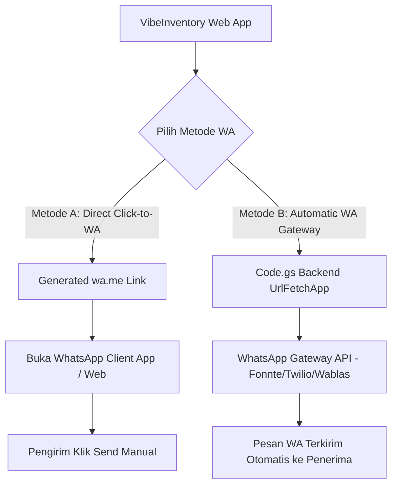

# WhatsApp Integration Architecture & Implementation Guide

Dokumen ini menjelaskan arsitektur integrasi **WhatsApp** pada aplikasi **VibeInventory (Google Apps Script Inventory System)**.

---

## 1. Executive Overview

Integrasi WhatsApp pada VibeInventory dirancang untuk mempermudah komunikasi operasional inventory, seperti:
1. Membagikan informasi stok barang kepada rekan kerja/manajemen.
2. Mengirimkan pesanan restok (*reorder*) langsung ke supplier saat stok menipis.
3. Mengirimkan bukti/struk transaksi (*Stock In* / *Stock Out*) ke pihak terkait.
4. Mendapatkan notifikasi stok kritis otomatis (*Low Stock Alert*).

---

## 2. Pilihan Arsitektur Integrasi

Terdapat 2 metode integrasi yang didukung oleh sistem ini:



### A. Metode A: Direct Click-to-WhatsApp (`wa.me`) - *Default & Recommended (Gratis)*

* **Prinsip Kerja**: Menggenerasi URL berbasis format standar `https://wa.me/{phone}?text={encoded_message}`.
* **Biaya**: **100% Gratis**, tidak membutuhkan registrasi API pihak ketiga atau pembayaran langganan.
* **Keuntungan**:
  * Aman, tidak memerlukan penyimpanan token API rahasia.
  * Kompatibel dengan semua jenis perangkat (Android, iOS, Windows, Mac).
  * Pengguna memiliki kontrol penuh untuk merevisi pesan sebelum dikirim.

#### Format Pesan Standar:

1. **Laporan / Share Detail Barang**:
```text
📦 *INFORMASI BARANG - VIBEINVENTORY*
• Kode: BRG-101
• Nama: Laptop Monitor 24 Inch
• Kategori: Elektronik
• Sisa Stok: 15 Unit
• Batas Min: 5 Unit
• Status: ✅ STOK AMAN
Waktu Akses: 27/07/2026 16.00
```

2. **Order Restok Supplier**:
```text
🛒 *PERMOHONAN RESTOK BARANG (REORDER)*
Kepada: Supplier / Purchasing
Dimohon untuk melakukan pengadaan kembali barang berikut:
• Kode Barang: BRG-104
• Nama Barang: Mouse Wireless Ergonomic
• Sisa Stok Saat Ini: 2 Pcs (Di bawah batas min: 5 Pcs)

Terima Kasih,
VibeInventory System
```

3. **Struk Transaksi**:
```text
📜 *STRUK TRANSAKSI STOK (VIBEINVENTORY)*
• No. Transaksi: TRX-9002
• Jenis: OUT (STOK KELUAR)
• Kode Barang: BRG-104
• Kuantitas: 3 Pcs
• Catatan: Penjualan toko online
• Pelaksana: staf
• Waktu: 27/07/2026 16.00
```

---

### B. Metode B: Automated WhatsApp Gateway API - *Backend Integration*

* **Prinsip Kerja**: Backend Google Apps Script (`Code.gs`) menggunakan `UrlFetchApp.fetch()` untuk mengirim pesan HTTP POST ke endpoint WA Gateway.
* **Biaya**: Tergantung penyedia service (Fonnte, Wablas, Twilio, Starsender, dll).

#### Struktur Fungsi `Code.gs`:

```javascript
/**
 * Helper untuk Mengirimkan Notifikasi WA Otomatis via Gateway API
 */
function sendWhatsAppNotification(phoneNumber, message, gatewayConfig = null) {
  if (!phoneNumber || !message) return { success: false, message: 'Nomor atau pesan kosong' };
  
  // Default Provider: Fonnte / Custom Gateway
  const apiKey = (gatewayConfig && gatewayConfig.apiKey) || 'YOUR_WA_GATEWAY_API_KEY';
  const endpoint = (gatewayConfig && gatewayConfig.endpoint) || 'https://api.fonnte.com/send';
  
  try {
    const payload = {
      target: phoneNumber,
      message: message
    };
    
    const options = {
      method: 'post',
      headers: {
        'Authorization': apiKey
      },
      payload: payload,
      muteHttpExceptions: true
    };
    
    const response = UrlFetchApp.fetch(endpoint, options);
    const result = JSON.parse(response.getContentText());
    return { success: true, response: result };
  } catch (err) {
    return { success: false, message: 'Gagal mengirim WA: ' + err.toString() };
  }
}
```

---

## 3. Komponen Antarmuka (UI/UX Component)

1. **Tombol Action di Tabel Inventori**: Tombol warna hijau dengan ikon WhatsApp pada setiap baris item.
2. **Tombol Action di Log Transaksi**: Tombol warna hijau untuk membagikan bukti transaksi.
3. **Modal WhatsApp Interaktif**: Memungkinkan pengguna memasukkan nomor telepon tujuan (opsional) atau langsung memilih jenis pesan (Share Info / Order Restok / Alert).
4. **Floating Contact Support Widget**: Tombol melayang di pojok kanan bawah antarmuka pengguna untuk menghubungi Admin / Helpdesk pusat.

---

## 4. Alur Menerima Pemesanan dari Client via Web App

Terdapat 2 skenario penerimaan pesanan dari client:

### A. Skenario Web Catalog Order Form -> Direct WA Admin (Gratis)
* **Alur**:
  1. Client membuka Web App Katalog VibeInventory.
  2. Client memilih barang dan kuantitas order.
  3. Client menekan tombol **"Pesan via WhatsApp"**.
  4. Web App secara otomatis menyusun rincian pesanan berformat rapi dan membuka WhatsApp Client yang langsung mengarahkan pesan ke WhatsApp Toko/Admin.
  5. Admin menerima pesan terstruktur di WA tanpa salah pesan/salah ketik.

```text
🛒 *PESANAN BARU DARI WEB APP*
Nama Pemesan: [Nama Client]
Nomor Kontak: [0812xxxx]

Detail Order:
• 2 Unit - Laptop Monitor 24 Inch (BRG-101)
• 1 Pcs - Keyboard Mechanical RGB (BRG-102)

Mohon konfirmasi ketersediaan dan total pembayaran. Terima Kasih!
```

### B. Perbandingan Integrasi Pemesanan Client

| Jenis Pemesanan | Apakah Client Bisa Pesan? | Membutuhkan WA Gateway API? | Keuntungan Utama |
|---|---|---|---|
| **Web Catalog Order Form** | ✅ **BISA** | ❌ **Tidak (100% Gratis)** | Tidak rawan salah ketik, bebas biaya API, aman, mudah dipakai client. |
| **Web Direct Order Database** | ✅ **BISA** | ❌ **Tidak (100% Gratis)** | Langsung memotong stok di Google Sheets & membuat catatan `STOCK_OUT`. |
| **Chat Bot WhatsApp Automatic** | ✅ **BISA** | ✅ **Ya (Berbayar API)** | Client ketik chat manual di WA & dibalas otomatis 24 jam oleh bot server. |

