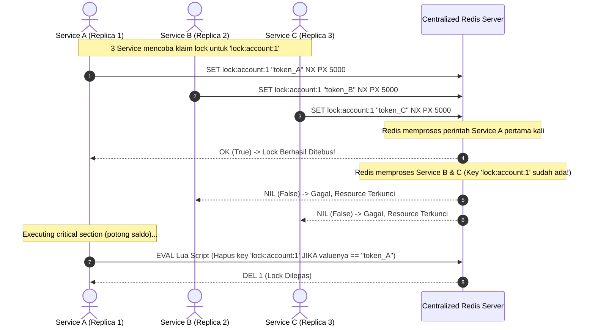

# Panduan Lengkap & Contoh Distributed Lock (Go, Echo v5, PostgreSQL, Redis)

Dokumen ini berisi **catatan konsep mendalam** dan **petunjuk penggunaan** untuk *Distributed Lock* (Penguncian Terdistribusi) menggunakan Bahasa Go, **Echo v5**, **PostgreSQL (`sqlx`)**, dan **Redis**.

---

## 📚 Table of Contents
1. [Apa itu Distributed Lock?](#1-apa-itu-distributed-lock)
2. [Mengapa Mutex Bawaan (sync.Mutex) Tidak Cukup?](#2-mengapa-mutex-bawaan-syncmutex-tidak-cukup)
3. [Distributed Lock Menggunakan Redis](#3-distributed-lock-menggunakan-redis)
   - [Prinsip SETNX & Expire](#prinsip-setnx--expire)
   - [Pelepasan Lock yang Aman (Lua Script)](#pelepasan-lock-yang-aman-lua-script)
   - [Redlock Algorithm (Multi-node Redis)](#redlock-algorithm-multi-node-redis)
4. [Distributed Lock Menggunakan PostgreSQL (Advisory Lock)](#4-distributed-lock-menggunakan-postgresql-advisory-lock)
   - [Session-Level Advisory Lock](#session-level-advisory-lock)
   - [Transaction-Level Advisory Lock](#transaction-level-advisory-lock)
   - [BigInt Key Hashing](#bigint-key-hashing)
5. [Tabel Perbandingan: Redis vs PostgreSQL Advisory Lock](#5-tabel-perbandingan-redis-vs-postgresql-advisory-lock)
6. [Mengapa Redis Lebih Populer Dibandingkan PostgreSQL untuk Lock?](#6-mengapa-redis-lebih-populer-dibandingkan-postgresql-untuk-lock)
7. [PostgreSQL Advisory Lock & Connection Pooler (PgBouncer)](#7-postgresql-advisory-lock--connection-pooler-pgbouncer)
8. [Perbedaan Distributed Lock vs Saga Pattern](#8-perbedaan-distributed-lock-vs-saga-pattern)
9. [Struktur Proyek Contoh](#9-struktur-proyek-contoh)
10. [Cara Menjalankan & Menguji Skenario](#10-cara-menjalankan--menguji-skenario)
11. [FAQ & Pertanyaan Umum (Tanya-Jawab Detail)](#11-faq--pertanyaan-umum-tanya-jawab-detail)

---

## 1. Apa itu Distributed Lock?

**Distributed Lock** adalah mekanisme sinkronisasi yang digunakan dalam sistem terdistribusi untuk memastikan bahwa dari beberapa proses/worker/replica server yang berjalan secara bersamaan (konkuren), **hanya ada satu proses yang dapat mengakses sumber daya kritis (critical section) pada satu waktu**.

### Masalah Kasus Nyata: Race Condition
Contoh kasus:
- 10 request bersamaan mencoba melakukan penarikan saldo/pembelian stok barang sisa 1.
- Tanpa locking, semua 10 request membaca saldo `100` pada waktu bersamaan, lalu semuanya mengurangi `50`, dan menyimpan saldo `50`. Saldo total tersisa berkurang hanya `50` padahal seharusnya `500` (atau ditolak karena saldo kurang). Masalah ini disebut **Race Condition / Lost Update**.

---

## 2. Mengapa Mutex Bawaan (`sync.Mutex`) Tidak Cukup?

Di Golang, kita biasa memakai `sync.Mutex` untuk mencegah race condition. Namun:
- `sync.Mutex` **hanya bekerja di dalam 1 process/memory aplikasi**.
- Pada arsitektur modern (Kubernetes, Docker Swarm, Multiple Replicas di backend), backend kita berjalan dalam 2, 5, atau 50 instance container terpisah.
- `sync.Mutex` pada Instance A **TIDAK tahu** apa yang terjadi di Instance B.

Oleh karena itu, kita membutuhkan **Centralized Lock Manager** eksternal seperti **Redis** atau **PostgreSQL**.

---

## 3. Distributed Lock Menggunakan Redis

Redis adalah sistem *in-memory data store* yang *single-threaded* untuk eksekusi command, menjadikannya pilihan sangat ideal dan cepat untuk distributed locking.

### Prinsip SETNX & Expire
Di Redis, lock didapatkan menggunakan perintah:
```sql
SET lock_key lock_value NX PX 5000
```
- `NX`: *Not eXists* — Key hanya dibuat jika key tersebut BELUM ada. Jika key sudah ada, perintah gagal (artinya lock sedang dipegang proses lain).
- `PX 5000`: Set TTL/Expiration time 5000 milidetik (5 detik) untuk mencegah **Deadlock** apabila instance aplikasi mendadak crash saat memegang lock.
- `lock_value`: Harus berupa **random UUID/token unik** milik request/goroutine tersebut.

### Pelepasan Lock yang Aman (Lua Script)
Saat melepas lock, proses TIDAK BOLEH langsung menghapus key `DEL lock_key`. Mengapa?
Jika transaksi A membutuhkan waktu 6 detik (TTL 5 detik habis), lock A akan expired dan dipegang oleh B. Jika A selesai di detik ke-6 lalu mengeksekusi `DEL lock_key`, A justru akan **menghapus lock milik B**!

Solusinya: Gunakan **Atomic Lua Script** yang memverifikasi bahwa `value` di Redis masih cocok dengan `lock_value` milik A sebelum melakukan `DEL`:

```lua
if redis.call("get", KEYS[1]) == ARGV[1] then
    return redis.call("del", KEYS[1])
else
    return 0
end
```

### Cara Kerja SETNX Terhadap Multi-Instance / Microservices

Cara kerja `SetNX` terhadap beberapa service/instance yang berjalan bersamaan berpusat pada **Sifat Single-Threaded & Atomic milik Redis**.

1. **Sifat Single-Threaded Redis (Prinsip Utama)**:
   Meskipun Anda memiliki 10 atau 100 instance microservice yang mengirimkan request `SetNX` di mikrodetik yang persis sama, Redis mengeksekusi perintah satu per satu dalam antrean (*Sequential Queue*). Tidak akan pernah ada dua perintah `SET` yang dieksekusi bersamaan di dalam engine Redis.

2. **Arti Perintah SetNX (SET if Not eXists)**:
   Di balik layar, perintah `r.client.SetNX(ctx, key, token, ttl)` mengirimkan perintah ke Redis:
   ```sql
   SET lock:account:1 "token_abc123" NX PX 5000
   ```
   * `NX` (*Not eXists*): "Hanya buat key ini jika key tersebut BELUM ADA di memori Redis."
   * `PX 5000`: "Set durasi expired (TTL) selama 5000ms (5 detik)."

3. **Simulasi Alur Kerja Antar-Service**:
   Bayangkan ada 3 Service (**Service A**, **Service B**, dan **Service C**) yang mencoba memotong saldo akun `#1` di waktu yang hampir bersamaan:



**Kronologi Detail**:
* **Service A sampai di Redis duluan (selisih nanodetik)**: Redis mengecek kunci `lock:account:1` -> Belum ada. Redis membuat kunci dengan isi `"token_A"` dan TTL 5 detik, lalu mengembalikan respon `OK` (`success = true`). Service A diizinkan masuk ke area kritis.
* **Service B & C sampai di Redis nanodetik berikutnya**: Redis mengecek kunci `lock:account:1` -> **Sudah ada!** (sedang dipegang Service A). Redis menolak membuat kunci baru dan mengembalikan respon `NIL` (`success = false`). Service B & C ditolak (gagal dapat lock) dan langsung mengembalikan error HTTP 423 / retry.
* **Service A Selesai (Release Lock)**: Service A memanggil `ReleaseLock` membawa `"token_A"`. Redis mengeksekusi Lua Script: *"Apakah isi `lock:account:1` masih `token_A`? Ya!"* -> Kunci dihapus. Resource `lock:account:1` kini bebas dan siap di-lock kembali oleh service lain.

#### 💡 Mengapa Butuh Token Unik per-Request?
Perhatikan baris kode 33–37 di `redis_lock.go`:
```go
tokenBytes := make([]byte, 16)
rand.Read(tokenBytes)
token := hex.EncodeToString(tokenBytes)
```
Fungsi token unik ini adalah untuk **mencegah salah hapus lock milik service lain**:
* Misal Service A butuh waktu 6 detik (karena query lambat), padahal TTL hanya 5 detik.
* Di detik ke-5, lock Service A hangus (expired).
* Di detik ke-5.1, Service B masuk dan mendapatkan lock (`lock:account:1` = `"token_B"`).
* Di detik ke-6, Service A selesai dan mencoba menghapus lock.
* **Tanpa token**: Service A akan asal `DEL lock:account:1`, padahal kunci itu sekarang milik Service B!
* **Dengan token (Lua Script)**: Service A mengirimkan `"token_A"`, Redis mengecek kunci ternyata berisi `"token_B"`. Redis menolak menghapus kunci tersebut sehingga lock milik Service B tetap aman.

### Redlock Algorithm (Multi-node Redis)
Jika Redis berjalan dalam cluster multi-master, algoritma **Redlock** digunakan dengan cara mencoba mendapatkan lock pada N node Redis secara independen. Jika berhasil memegang lock di mayoritas node (misal 3 dari 5 node) dalam waktu TTL, maka lock dianggap valid.

---

## 4. Distributed Lock Menggunakan PostgreSQL (Advisory Lock)

PostgreSQL menyediakan fitur bawaan bernama **Advisory Locks**. Ini adalah penguncian berbasis angka integer (64-bit BigInt atau dua 32-bit Integer) yang ditentukan oleh pengembang (tidak terikat pada baris tabel/row DB fisik).

### Session-Level Advisory Lock
Lock terikat pada **Koneksi Database (Session)**. Lock ini akan tetap aktif sampai dilepas secara manual atau sampai koneksi DB ditutup/putus.
- `SELECT pg_try_advisory_lock(12345)` -> Mengembalikan `true` jika berhasil lock, `false` jika sedang di-lock sesi lain (non-blocking).
- `SELECT pg_advisory_unlock(12345)` -> Melepas lock secara manual.

### Transaction-Level Advisory Lock
Lock terikat pada **Transaksi Database (`BEGIN ... COMMIT/ROLLBACK`)**. Lock ini secara otomatis dilepas begitu transaksi selesai (`COMMIT` / `ROLLBACK`).
- `SELECT pg_try_advisory_xact_lock(12345)` -> Mencoba lock pada level transaksi saat ini.

### BigInt Key Hashing
Karena Postgres Advisory Lock membutuhkan kunci angka (`int64`), kita bisa mengubah nama string (misal `"account_lock_1001"`) menjadi `int64` menggunakan algoritma Hashing seperti **FNV-1a 64-bit**.

---

## 5. Tabel Perbandingan: Redis vs PostgreSQL Advisory Lock

| Fitur | Redis Distributed Lock | PostgreSQL Advisory Lock |
| :--- | :--- | :--- |
| **Kategori** | In-memory key-value lock | Relational DB session/xact lock |
| **Kecepatan** | ⚡ Sangat Cepat (~sub-millisecond) | 🚀 Cepat (~1-5 millisecond) |
| **Pencegahan Deadlock** | Berbasis TTL Expiration (`PX`) | Berbasis Session / Transaction Rollback |
| **Transaksional** | Terpisah dari DB transaction | Menyatu dengan DB transaction (`xact_lock`) |
| **Kompleksitas** | Membutuhkan infrastruktur Redis | Tidak perlu infra baru jika sudah ada Postgres |
| **Kasus Penggunaan Terbaik** | High-throughput, rate-limiting, job queue | Financial transaction, idempotency di DB, batch processing |

---

## 6. Mengapa Redis Lebih Populer Dibandingkan PostgreSQL untuk Lock?

1. **⏱️ TTL / Expiration Bawaan**: Redis dapat menghapus kunci otomatis setelah N milidetik via `PX`. Ini mencegah deadlock jika aplikasi crash. Pada Postgres Session lock, koneksi tersangkut dapat mengunci resource secara permanen sampai connection dibunuh.
2. **⚡ Performa High-Throughput (In-Memory)**: Redis beroperasi di RAM secara single-threaded sub-millisecond. Postgres Advisory lock yang terlalu berat dapat menguras connection pool dan CPU database utama.
3. **🌐 DB-Neutral Microservices**: Berbagai service (Go, Node.js, Java, Python) dengan database berbeda (MongoDB, Postgres, MySQL) dapat menggunakan Redis sebagai centralized lock manager tunggal.
4. **📦 Ekosistem Library Matang**: Library seperti Redisson, Redsync, dan Redlock mengabstraksi auto-renewal TTL (*watchdog*) dan retry mechanism secara plug-and-play.

---

## 7. PostgreSQL Advisory Lock & Connection Pooler (PgBouncer)

Jika menggunakan **PgBouncer** dengan mode **Transaction Pooling**:

* ✅ **`pg_try_advisory_xact_lock()` (Transaction-Level)**: **BISA & AMAN**. PgBouncer menjaga koneksi backend fisik selama transaksi (`BEGIN ... COMMIT`). Begitu transaksi Selesai, lock otomatis lepas di Postgres sebelum koneksi dilepas ke pool.
* ❌ **`pg_try_advisory_lock()` (Session-Level)**: **TIDAK BISA / BERBAHAYA**. PgBouncer dapat mengarahkan query unlock ke koneksi backend yang berbeda, menyebabkan *lock leak* atau deadlock pada koneksi lain.

---

## 8. Perbedaan Distributed Lock vs Saga Pattern

| Aspek | Distributed Lock | Saga Pattern |
| :--- | :--- | :--- |
| **Masalah Utama** | **Concurrency Control / Race Condition** (Banyak request bersamaan mengakses 1 data). | **Distributed Transaction** (Workflow bisnis multi-step di banyak database/microservices). |
| **Fokus** | **Mutual Exclusion**: Memastikan hanya 1 proses berjalan di critical section pada satu waktu. | **Eventual Consistency**: Menjaga data tetap konsisten jika transaksi multi-step gagal di tengah jalan. |
| **Mekanisme Fail** | Request ditolak (*rejected / 423 Locked*) atau retry. | Menjalankan **Compensating Transactions** (aksi balik/refund) untuk me-rollback step sebelumnya. |
| **Analogi** | Berebut 1 tiket konser (hanya 1 orang yang berhasil bayar). | Alur checkout e-commerce (Potong Saldo -> Kurangi Stok -> Buat Resi). Jika buat resi gagal, stok & saldo dikembalikan. |

> 💡 **Catatan**: Keduanya bisa digunakan bersamaan! Saga Pattern mengatur workflow besar antar-microservice, sedangkan di dalam salah satu step transaksi lokal, microservice menggunakan Distributed Lock untuk mencegah race condition.

---

## 9. Struktur Proyek Contoh

- **`main.go`**: HTTP Server menggunakan **Echo v5** (`github.com/labstack/echo/v5`).
- **`internal/lock/redis_lock.go`**: Implementasi Redis lock via `SETNX` & Lua Script.
- **`internal/lock/pg_lock.go`**: Implementasi PostgreSQL Advisory Lock (Session & Transaction level).
- **`internal/service/wallet.go`**: Logika bisnis simulasi transaksi keuangan / saldo.
- **`run_all_tests.sh`**: Script pengujian konkurensi (10 request paralel secara serentak).

---

## 10. Cara Menjalankan & Menguji Skenario

### Pengujian Satu-Langkah Otomatis (All-in-One)
Anda dapat langsung menjalankan script berikut di terminal:
```bash
chmod +x run_all_tests.sh
./run_all_tests.sh
```

**Apa yang dilakukan script `run_all_tests.sh` secara otomatis?**
1. **Di Awal**: Otomatis mengeksekusi `docker compose up -d --wait` (menyiapkan container Postgres & Redis).
2. **Setup Server**: Otomatis menjalankan server Go Echo v5 di background.
3. **Eksekusi 5 Skenario**: Menguji 10 request serentak di tiap skenario.
4. **Di Akhir (`TRAP Cleanup`)**: Otomatis mematikan server Go dan mengeksekusi `docker compose down` sehingga lingkungan lokal Anda tetap bersih!

Script akan mengeksekusi 5 skenario:
1. **Skenario 1 (Tanpa Lock)** -> Menunjukkan data saldo rusak akibat race condition.
2. **Skenario 2 (Dengan Redis Lock + Context Timeout)** -> Menunjukkan saldo terpotong secara tepat & konsisten dengan proteksi context deadline.
3. **Skenario 2B (Dengan Redis Watchdog Lock)** -> Menunjukkan perpanjangan TTL otomatis (Auto-Renewal Heartbeat) selama proses Go masih aktif.
4. **Skenario 3 (Dengan PG Session Advisory Lock)** -> Menunjukkan proteksi sukses via PostgreSQL session lock.
5. **Skenario 4 (Dengan PG Transaction Advisory Lock)** -> Menunjukkan proteksi sukses via PostgreSQL transaction lock.

---

## 11. FAQ & Pertanyaan Umum (Tanya-Jawab Detail)

### Q1: Apakah `SETNX` ini hanya bisa ada 1 kunci di seluruh Redis?
**Tidak.** `SETNX` adalah perintah umum Redis yang bekerja pada nama *key* spesifik.
* Redis dapat menampung jutaan kunci penguncian secara independen pada saat bersamaan (misal: `lock:account:1`, `lock:account:2`, `lock:order:999`, dsb).
* Penguncian kunci `lock:account:1` **TIDAK me-lock atau mengganggu** kunci `lock:account:2` milik pengguna lain.

### Q2: Dari mana String `lock:account:1` itu dibuat?
String kunci diproduksi secara **dinamis oleh kode aplikasi Go** berdasarkan ID resource yang ingin dilindungi.
Contoh pada `internal/service/wallet.go`:
```go
lockKey := fmt.Sprintf("lock:account:%d", accountID)
```
Jika `accountID = 1`, maka fungsi memformat string menjadi `"lock:account:1"`. Jika `accountID = 5`, maka kunci yang terbentuk adalah `"lock:account:5"`.

### Q3: Jika TTL (5 detik) sudah habis di detik ke-5, mengapa Service A di detik ke-6 tetap berjalan dan mencoba me-release lock?
**Karena TTL Redis dieksekusi oleh server Redis, bukan oleh thread/proses Go aplikasi.**
* **Redis**: Hanya menghapus record kunci di memorinya saat timer 5 detik habis. Redis **TIDAK mempunyai akses** untuk menghentikan, menembak, atau mem-pause goroutine/proses aplikasi Go.
* **Service A (Aplikasi Go)**: Thread/goroutine Go tetap menjalankan instruksi kodenya (misal sedang menunggu query database yang sangat lambat/I-O blocking). Ketika proses Go me-reach `defer ReleaseLock()`, perintah hapus dikirim.
* **Alasan perlunya Random Token & Lua Script**: Karena Service A tetap berjalan hingga detik ke-6 (saat mana kunci Redis sudah hangus dan diambil oleh Service B di detik 5.1), Lua Script memastikan Service A **TIDAK secara tidak sengaja menghapus lock milik Service B**. Service A mengirim token miliknya (`token_A`), Redis mengecek dan menolak hapus karena value kunci sudah berganti menjadi (`token_B`).

### Q4: Kalau begitu, mengapa ada Distributed Lock jika proses aplikasi tetap berjalan walaupun TTL sudah habis?
1. **TTL Adalah Jaring Pengaman Darurat (Safety Net)**:
   Tujuan utama TTL adalah mencegah **Deadlock Permanen** jika aplikasi **CRASH / MATI TOTAL**. Jika Service A mati mendadak, tanpa TTL kunci tersangkut selamanya. Dengan TTL, sistem otomatis pulih (*self-healing*) dalam 5 detik.
2. **Dalam 99.9% Kasus Normal**:
   Proses bisnis normal hanya memakan waktu 50ms - 200ms (jauh lebih cepat dibanding TTL 5 detik), sehingga Service A menyelesaikan tugasnya dan melepas lock di milidetik ke-100 secara aman.
3. **Penanganan 0.1% Kasus Ekstrem (Long Running Process)**:
   Untuk menangani kasus saat proses berjalan sangat lama melebihi TTL, industri menggunakan 3 strategi:
   * **Lock Extension / Watchdog Mechanism (Auto-Renewal)**: Background goroutine memperpanjang TTL kunci di Redis setiap ~1.6 detik selama proses Go masih hidup (diimplementasikan di `AcquireLockWithWatchdog` / `LockGuard` di `internal/lock/redis_lock.go`).
   * **Context Timeout di Go**: Menggunakan `context.WithTimeout(ctx, 4*time.Second)` yang durasinya lebih pendek dari 5s TTL. Go membatalkan transaksi DB otomatis jika waktu eksekusi melampaui 4 detik.
   * **Fencing Tokens / Optimistic Locking**: Menggunakan versi *incremental* di database (`WHERE id = 1 AND version = 101`) untuk menolak komit transaksi yang terlambat.

