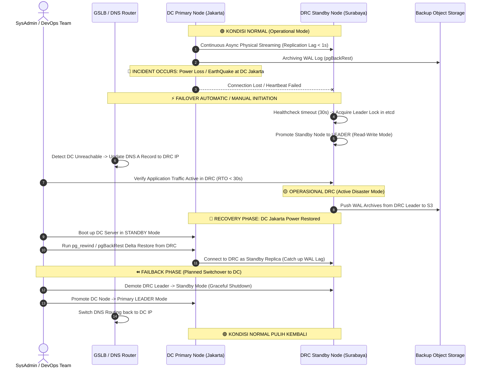

# 03. Prosedur Pemulihan Bencana (Failover & Failback SOP)

Dokumen ini memuat Standard Operating Procedure (SOP) saat terjadi insiden bencana (*Disaster*) pada Main Data Center (DC) serta langkah-langkah pemulihan kembali (*Failback*) ke kondisi normal.

---

## 1. Flowchart Skenario Pemulihan Bencana



---

## 2. SOP Failover Ke DRC (Saat Bencana Happened)

### A. Automatic Failover (Patroni Automation)
Apabila Patroni Orchestrator diaktifkan:
1. Daemon Patroni di node DRC secara otomatis mendeteksi mundurnya Leader DC setelah `ttl: 30` detik.
2. Jika etcd di DRC mengonfirmasi mayoritas quorum setuju, Patroni memanggil perintah internal `pg_ctl promote`.
3. Node PostgreSQL DRC berubah status dari `Standby` (Read-Only) menjadi `Primary Leader` (Read-Write).
4. GSLB memindahkan traffic DNS ke IP DRC.

### B. Manual Emergency Override (Jika Membutuhkan Approval Manusia)
Jika kebijakan perusahaan mewajibkan konfirmasi manual sebelum failover DRC:
```bash
# 1. Login ke Node DRC via SSH
ssh admin@drc-db01.internal

# 2. Cek status cluster saat ini
patronictl -c /etc/patroni/patroni.yml list

# 3. Jalankan pengangkatan paksa DRC sebagai Leader baru
patronictl -c /etc/patroni/patroni.yml failover --candidate drc-db01

# 4. Alihkan traffic DNS pada GSLB / Router Cloudflare
curl -X PUT "https://api.cloudflare.com/client/v4/zones/{zone_id}/dns_records/{record_id}" \
     -H "Authorization: Bearer YOUR_API_TOKEN" \
     -H "Content-Type: application/json" \
     --data '{"type":"A","name":"api.domain.com","content":"198.51.100.10","ttl":60}'
```

---

## 3. SOP Failback Ke DC Utama (Setelah DC Pulih)

Setelah fasilitas fisik DC Utama (Jakarta) kembali beroperasi normal, **JANGAN LANGSUNG MATIKAN DRC**. Jalankan prosedur sinkronisasi balik (*Resynchronization*) terlebih dahulu untuk mencegah kehilangan data selama DRC beroperasi.

### Langkah 1: Jadikan Node DC sebagai Standby bagi DRC
1. Nyalakan server database di DC Utama.
2. Jalankan perintah `pg_rewind` untuk menyelaraskan timeline database DC dengan timeline baru DRC (menghapus transaksi divergen di DC jika ada).
```bash
# Pada Node DC Utama:
pg_rewind --target-pgdata=/var/lib/postgresql/data \
          --source-server="host=192.168.20.11 port=5432 user=replicator password=SecretPassword"
```
3. Konfigurasikan node DC Utama untuk mereplikasi data dari DRC (`192.168.20.11`).

### Langkah 2: Verifikasi Replication Lag = 0
Pastikan selisih byte/waktu antara DRC (Leader) dan DC (Standby) telah mencapai nol:
```sql
-- Jalankan di DRC Leader:
SELECT client_addr, state, sync_state, 
       pg_wal_lsn_diff(pg_current_wal_lsn(), replay_lsn) AS lag_bytes 
FROM pg_stat_replication;
```

### Langkah 3: Planned Switchover (Graceful Failback)
Lakukan switchover terencana pada window pemeliharaan (*maintenance window*):
```bash
# Lakukan switchover graceful mengembalikan Leader ke Node DC
patronictl -c /etc/patroni/patroni.yml switchover --master drc-db01 --candidate dc-db01 --scheduled scheduled_time

# Kembalikan rute DNS GSLB ke IP DC Utama
curl -X PUT "https://api.cloudflare.com/client/v4/zones/{zone_id}/dns_records/{record_id}" \
     -H "Authorization: Bearer YOUR_API_TOKEN" \
     -H "Content-Type: application/json" \
     --data '{"type":"A","name":"api.domain.com","content":"203.0.113.10","ttl":60}'
```

---

## 4. Mekanisme Reverse (Reverse Replication, Reverse Proxy & Reverse Sync)

Istilah **"Reverse"** dalam arsitektur DC-DRC mencakup 3 mekanisme utama saat pemulihan:

### A. Reverse Replication (Replikasi Terbalik)
Saat bencana terjadi, DRC bertindak sebagai **Primary/Leader** baru dan menerima transaksi *Write* dari pengguna. Ketika server DC Utama (Jakarta) selesai diperbaiki dan dinyalakan kembali, arah aliran data otomatis **dibalik**:
- **DRC (Surabaya)**: Berperan sementara sebagai **Master / Streaming Source**.
- **DC Utama (Jakarta)**: Berperan sebagai **Standby Target / Replica**.

```
[Transaksional User selama Disaster] ──► [DRC Node (Active Leader)]
                                                 │
                                                 ▼ (Reverse Replication Stream)
                                        [DC Node (Standby Receiver)]
```

### B. Reverse Sync (`pg_rewind`)
Jika DC Utama mati secara tidak sempurna (*unclean shutdown*), mungkin ada sisa transaksi WAL di DC yang belum sempat terkirim ke DRC.
- **Masalah**: Timeline database DC dan DRC menjadi terpisah (*Divergent Timelines*).
- **Solusi**: Perintah `pg_rewind` membandingkan WAL LSN antara DC dan DRC, membatalkan (*rollback*) transaksi lokal DC yang terpisah, lalu memutarbalikkan (*rewind*) data DC ke titik persimpangan (*fork point*) agar cocok dengan DRC, baru setelah itu *Reverse Replication* dimulai.

### C. Reverse Proxy & Traffic Switchback
Pada layer aplikasi dan load balancing, pembalikan rute dilakukan pada dua tingkat:
1. **Reverse Proxy (HAProxy / NGINX)**:
   - Diatur agar *backend pool* beralih dari DRC node kembali ke DC node setelah ketersediaan data 100% konsisten.
2. **Reverse Routing (GSLB / BGP Announcement)**:
   - Pengembalian pengumuman rute IP Public (*BGP Re-advertisement*) kembali dari router Surabaya ke router Jakarta.

---

## 5. Checklist Pengujian DRC (Disaster Recovery Drill)

Pengujian DRC (*DR Drill*) wajib dilakukan **minimal 1-2 kali setahun** untuk menjamin kesiapan tim dan infrastruktur:

- [ ] **Tabletop Exercise**: Simulasi skenario diskusi penanganan bencana dengan seluruh pemangku kepentingan.
- [ ] **Data Integrity Check**: Verifikasi integritas checksum data di node DRC sebelum failover.
- [ ] **Network Switchover Test**: Menguji perpindahan DNS GSLB dan kecocokan sertifikat SSL di DRC.
- [ ] **Application Smoke Test**: Memastikan aplikasi dapat menulis data (`INSERT/UPDATE/DELETE`) ke database DRC tanpa error izin (*permission denied*).
- [ ] **Reverse Replication Test**: Memastikan data baru yang dibuat di DRC selama pengujian berhasil tersinkronisasi kembali ke DC Utama.
- [ ] **Failback Re-sync Test**: Pengujian pembalikan peran (*planned switchover*) dari DRC kembali ke DC Utama.

