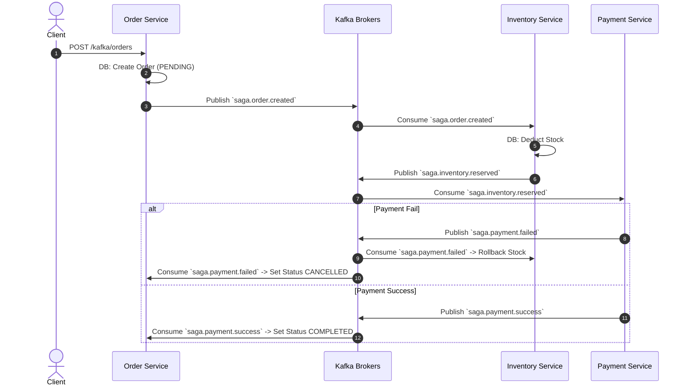
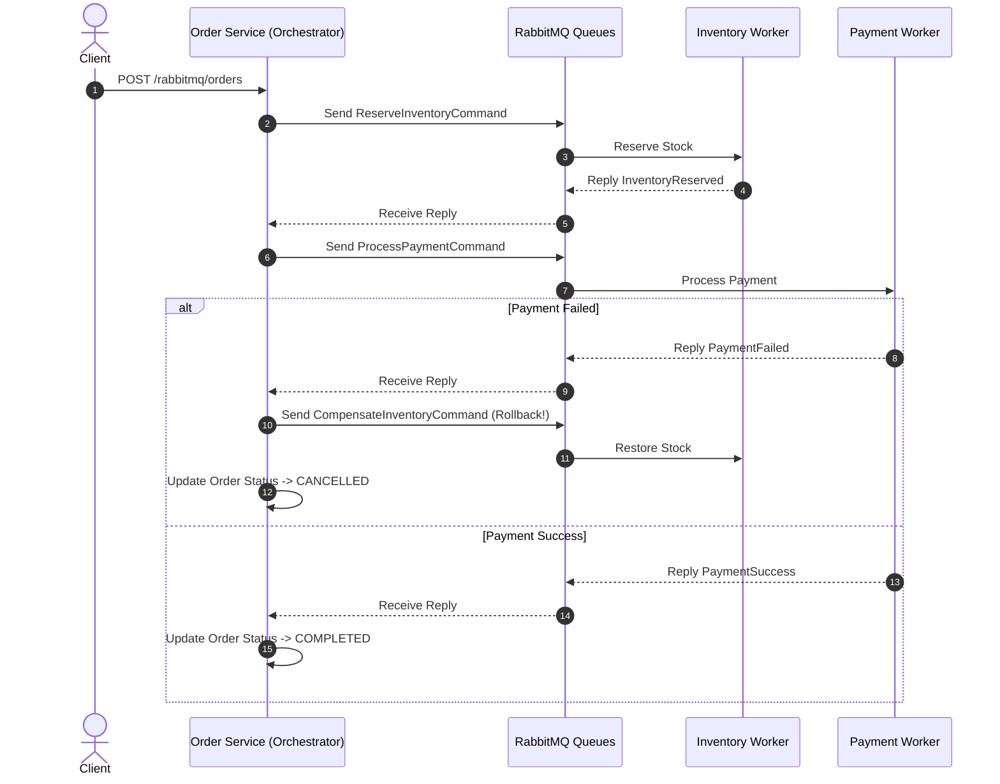

# Saga Pattern Demo dengan Golang, PostgreSQL, PgBouncer, Kafka, & RabbitMQ

Repositori ini berisi contoh implementasi dan penjelasan komprehensif mengenai **Saga Pattern** dalam arsitektur Microservices menggunakan **Golang (Echo Framework)**, **PostgreSQL** dengan **PgBouncer**, **Apache Kafka**, dan **RabbitMQ**.

---

## 📌 1. Apa itu Saga Pattern?

Dalam arsitektur microservices, transaksi yang melibatkan beberapa service tidak dapat menggunakan transaksi ACID database tunggal (*Two-Phase Commit / 2PC* cenderung lambat dan *tightly coupled*). **Saga Pattern** menyelesaikan masalah transaksi terdistribusi ini dengan membagi transaksi menjadi beberapa **transaksi lokal** di masing-masing service.

Setiap langkah memperbarui database lokal dan menerbitkan pesan/event. Jika salah satu langkah gagal, Saga akan mengeksekusi **Compensation Transactions (Kompensasi/Rollback)** untuk membatalkan efek dari langkah-langkah sebelumnya.

Terdapat 2 jenis pendekatan Saga Pattern:
1. **Choreography-based Saga** (Event-Driven)
2. **Orchestration-based Saga** (Command-Driven)

---

## 💡 Catatan Arsitektur: Manajemen Stok Saat Menunggu Pembayaran

Dalam implementasi *Saga Pattern* untuk sistem pemesanan e-commerce, jika waktu pembayaran memakan waktu lama, praktik terbaiknya adalah menggunakan pendekatan **Reservasi Stok (Stock Reservation / Soft Allocation)**:

1. **Reservasi Stok (Pending Payment)**: Saat pesanan dibuat, stok tidak langsung dikurangi secara permanen. Sebaliknya, stok dikunci sementara (di-reserve). Ini berarti, **stok yang bisa dilihat dan dibeli oleh user lain adalah stok keseluruhan dikurangi reservasi stok yang sedang berjalan (menunggu pembayaran)**. Secara rumus: **`Stok yang Tersedia (Available) = Total Stok Fisik - Total Stok yang Sedang Di-reserve`**. Dengan pendekatan ini, aplikasi terhindar dari masalah *overselling* (stok habis tapi sistem masih membiarkan user lain membelinya).
2. **Payment Success**: Jika pesanan berhasil dibayar, *reserved stock* dikurangi secara permanen (transaksi Saga selesai dengan sukses).
3. **Payment Timeout / Failed**: Jika pengguna gagal membayar atau melewati batas waktu (*timeout*, misalnya 1 jam), Saga akan memicu **Compensating Transaction** ke *Inventory Service* untuk melakukan *rollback*, yaitu mengembalikan *reserved stock* menjadi *available stock* lagi sehingga bisa dibeli orang lain.

---

## ❓ 2. Mengapa Kafka untuk Choreography dan RabbitMQ untuk Orchestration?

### A. Kafka $\rightarrow$ Choreography Saga (Event-Driven)
- **Mengapa Kafka?**: Kafka dirancang sebagai **Distributed Event Streaming Platform**. Event disimpan secara *immutable* dalam topic, dan banyak consumer (microservices) dapat mendengarkan event yang sama tanpa perlu tahu siapa penerbitnya (*Decoupled*).
- **Cara Kerja Choreography**: Tidak ada manager/dalang pusat. 
  - `Order Service` terbit event `saga.order.created` $\rightarrow$
  - `Inventory Service` dengar event, potong stok, lalu terbit `saga.inventory.reserved` $\rightarrow$
  - `Payment Service` dengar event, proses bayar, jika gagal terbit `saga.payment.failed` $\rightarrow$
  - `Inventory Service` dengar `saga.payment.failed` dan melakukan **Kompensasi (Mengembalikan Stok)**.

### B. RabbitMQ $\rightarrow$ Orchestration Saga (Command-Driven dengan 3 Service)
- **Mengapa RabbitMQ?**: RabbitMQ berbasis **AMQP Message Broker** yang sangat hebat dalam routing pesan langsung (*Direct Exchange/Queues*) secara spesifik ke antrean worker yang dituju.
- **Cara Kerja Orchestration (3 Dedicated Services)**:
  1. **Order Service (Saga Orchestrator)**: Berindak sebagai "konduktor" yang memimpin alur transaksi terdistribusi.
  2. **Inventory Worker Service**: Menerima perintah reservasi & kompensasi stok dari antrean RabbitMQ (`cmd.inventory.reserve` & `cmd.inventory.compensate`).
  3. **Payment Worker Service**: Menerima perintah eksekusi pembayaran dari antrean RabbitMQ (`cmd.payment.process`).
- **Alur Kerja**: Orchestrator mengirim Command sekuensial via RabbitMQ. Jika Payment Worker mengembalikan status gagal, Orchestrator secara proaktif mengirim `CompensateInventoryCommand` ke RabbitMQ untuk memulihkan stok.

#### 🔍 Catatan: Mengapa Orchestration Command Mirip REST HTTP Call?

Pola **Orchestration Saga** menggunakan Command memang terasa mirip dengan REST HTTP Call (RPC-style).

- **🤝 Mengapa Terasa Mirip HTTP Call? (Persamaannya)**
  - **Point-to-Point & Ditujukan Spesifik**:
    - **HTTP**: `POST http://payment-service/pay`
    - **RabbitMQ Command**: Kirim pesan langsung ke antrean `cmd.payment.process`
  - **Imperative (Berbasis Perintah "Lakukan X")**:
    - Tidak seperti Event (*"Order Telah Dibuat"*), Command adalah instruksi tegas (*"Potong Stok Sekarang"*, *"Proses Bayar Sekarang"*).
  - **Alur Sekuensial / Request-Reply**:
    - Orchestrator (konduktor) menunggu hasil/jawaban dari Worker A sebelum melanjutkan perintah ke Worker B. Jika Worker B gagal, Orchestrator menyuruh Worker A melakukan undo (kompensasi).

- **⚡ Lantas, Kenapa Pakai RabbitMQ alih-alih HTTP Call Biasa?**
  Meskipun logika alurnya mirip HTTP Call, papan transmisi komunikasinya sangat berbeda:

  | Karakteristik | Direct HTTP Call | RabbitMQ Command (Asynchronous Messaging) |
  | :--- | :--- | :--- |
  | **Koneksi / Eksekusi** | **Blocking (Synchronous)**: Orchestrator menahan thread/koneksi TCP sambil menunggu respon HTTP. | **Non-Blocking (Asynchronous)**: Orchestrator mengirim pesan ke broker lalu melepaskan thread (bisa diproses via callback/coroutine). |
  | **Ketersediaan Worker** | Jika `Payment Service` **down/restart**, HTTP call langsung **error/timeout** (500/504). | Jika `Payment Service` **down**, pesan **tersimpan aman di queue**. Saat service menyala kembali, pesan langsung diproses. |
  | **Traffic Spike / Backpressure** | Jika ada 10.000 HTTP request masuk bersamaan, `Payment Service` bisa runtuh (*overwhelmed*). | Worker mengambil pesan dari queue sesuai kapasitasnya (*Competing Consumers / Rate Limiting*). |
  | **Network Decoupling** | Orchestrator harus tahu URL/IP dari `Inventory` & `Payment Service` (via Service Discovery). | Services **tidak saling tahu IP/URL**, mereka hanya tahu nama Queue/Exchange RabbitMQ. |

- **💡 Kesimpulan**
  Pola ini dalam *messaging world* dikenal sebagai **Request-Reply Pattern / Remote Procedure Call (RPC) over Messaging Queue**.

  > **Ringkasan:** Orchestrator menggunakan logika Point-to-Point Command ala HTTP, namun memanfaatkan ketahanan (*resilience*), antrean (*buffering*), dan sifat *non-blocking* milik Message Broker (RabbitMQ).

### C. Alasan Utama Kenapa File `main.go` Dibedakan (`cmd/kafka_saga/main.go` vs `cmd/rabbitmq_saga/main.go`)

Alasan utama kenapa Kafka dan RabbitMQ dibedakan file main-nya adalah karena perbedaan mendasar pada pola arsitektur, paradigma infrastruktur, dan isolasi proses microservices:

1. **Memisahkan 2 Pola Arsitektur Saga yang Berbeda (Choreography vs Orchestration)**
   - **Kafka (`cmd/kafka_saga/main.go`)** digunakan untuk mendemonstrasikan **Choreography Saga**:
     - Tidak ada konduktor/bos pusat.
     - **Berbasis Event-Driven**: Setiap service hanya menerbitkan (*publish*) event ke Kafka Topic (contoh: `saga.order.created`) dan service lain mendengarkan (*subscribe*) event tersebut secara independen (*decoupled*).
   - **RabbitMQ (`cmd/rabbitmq_saga/main.go`)** digunakan untuk mendemonstrasikan **Orchestration Saga**:
     - Ada konduktor pusat (**Saga Orchestrator**) di Order Service.
     - **Berbasis Command-Reply (RPC)**: Orchestrator mengirim instruksi perintah (*Command*) secara sekuensial ke antrean RabbitMQ (contoh: `cmd.inventory.reserve`), lalu worker (*Inventory Worker* & *Payment Worker*) membalas (*Reply*) kembali ke Orchestrator.
   - **Jika disatukan dalam 1 `main.go`**: Kode akan sangat rungkut (*tangled/tightly coupled*), alur event loop Kafka akan bercampur dengan alur queue listener RabbitMQ, sehingga sulit membedakan murni mana alur Choreography dan mana alur Orchestration.

2. **Perbedaan Cara Kerja Infrastruktur Message Broker**

| Komponen | Kafka (Choreography) | RabbitMQ (Orchestration) |
| :--- | :--- | :--- |
| **Model Pengiriman** | **Pull-based (Streaming Log)**: Consumer menarik event secara kontinyu dari Offset Topic. | **Push-based (Message Queue)**: Broker mendorong pesan langsung ke antrean worker yang terhubung (*Direct Routing*). |
| **Pola Komunikasi** | **Pub-Sub**: Satu event dipublikasikan ke topic dan bisa dibaca banyak service sekaligus. | **Point-to-Point Command**: Satu perintah dikirim ke queue spesifik dan membutuhkan `CorrelationID` / `ReplyTo` queue. |
| **State Management** | State transaksi tersebar di masing-masing participant service. | State alur transaksi dikendalikan penuh oleh Orchestrator. |

3. **Independensi Deployment Microservices**
   Dalam standar industri (*best practices microservices*):
   - Setiap service dijalankan sebagai proses/binary terpisah pada container Docker sendiri (Port `:8081` untuk Kafka Service, dan Port `:8082` untuk RabbitMQ Service).
   - Memisahkan `main.go` memungkinkan masing-masing service memiliki *lifecycle*, port, penanganan *gracefully shutdown*, dan *dependency library* (`segmentio/kafka-go` vs `rabbitmq/amqp091-go`) yang terisolasi secara bersih.

---


## 🐘 3. Peran PostgreSQL & PgBouncer

Dalam arsitektur microservices enterprise, koneksi langsung dari banyak instance service ke PostgreSQL dapat menyebabkan batas `max_connections` terlampaui dan *resource exhaustion*.

- **PostgreSQL**: Menyimpan tabel `orders`, `inventory`, `payments`, dan `saga_logs`.
- **PgBouncer**: Bertindak sebagai **Lightweight Connection Pooler** di depan Postgres (port `6432`). PgBouncer mengelola antrean koneksi (*Transaction Pooling Mode*), sehingga koneksi database tetap stabil dan hemat resource meskipun dipanggil secara masif oleh background consumer.

---

## 🏗️ 4. Arsitektur & Diagram Sequence

### Kafka Choreography Sequence


### RabbitMQ Orchestration Sequence


---

## 🚀 5. Cara Menjalankan Aplikasi

### Persyaratan:
- Docker & Docker Compose
- `bash`, `curl`, `jq` (untuk menjalankan script skenario)

### Langkah 1: Jalankan Container dengan Docker Compose
```bash
docker-compose up -d --build
```

Langkah ini akan menyalakan 5 container:
1. `saga_postgres`: Database PostgreSQL 16
2. `saga_pgbouncer`: Connection pooler PgBouncer
3. `saga_kafka`: Apache Kafka (KRaft mode)
4. `saga_rabbitmq`: RabbitMQ + Management UI (Port 15672)
5. `saga_kafka_svc`: Microservice Saga Kafka (Port 8081)
6. `saga_rabbitmq_svc`: Microservice Saga RabbitMQ (Port 8082)

### Langkah 2: Jalankan Skenario Pengujian Otomatis
```bash
chmod +x run_scenarios.sh
./run_scenarios.sh
```

Script `./run_scenarios.sh` akan mengeksekusi 4 skenario:
1. **Skenario 1 (Kafka Happy Path)**: Transaksi sukses, stok berkurang, order status `COMPLETED`.
2. **Skenario 2 (Kafka Rollback)**: Pembayaran gagal, kompensasi otomatis mengembalikan stok, order status `CANCELLED`.
3. **Skenario 3 (RabbitMQ Happy Path)**: Transaksi via Orchestrator sukses, order status `COMPLETED`.
4. **Skenario 4 (RabbitMQ Rollback)**: Pembayaran gagal via Orchestrator, perintah kompensasi terkirim ke antrean, stok dipulihkan, order status `CANCELLED`.

---

## 📡 6. REST API Reference

| Method | Endpoint | Description | Service |
| :--- | :--- | :--- | :--- |
| `POST` | `/kafka/orders` | Trigger Kafka Choreography Saga | Kafka Svc (`:8081`) |
| `POST` | `/rabbitmq/orders` | Trigger RabbitMQ Orchestration Saga | RabbitMQ Svc (`:8082`) |
| `GET` | `/orders/:id` | Check Order status & Detailed Saga Execution Logs | Both (`:8081` & `:8082`) |
| `GET` | `/inventory` | Check current inventory stock in Database | Both (`:8081` & `:8082`) |

### Example Request Body (`POST /kafka/orders` & `/rabbitmq/orders`):
```json
{
  "item_id": "ITEM-001",
  "quantity": 2,
  "amount": 150000,
  "fail_payment": false
}
```
*(Set `"fail_payment": true` untuk memicu skenario Rollback / Kompensasi)*.

---

## 🔒 7. Menggabungkan Saga Pattern dengan Distributed Lock

**BISA dan SANGAT DIREKOMENDASIKAN.**

Menggabungkan **Saga Pattern** dengan **Distributed Lock** (misalnya menggunakan **Redis Redlock**, **PostgreSQL Advisory Lock**, atau **etcd**) adalah praktik standar di industri enterprise untuk menjamin kestabilan transaksi terdistribusi.

### 💡 Mengapa Keduanya Perlu Digabung?

| Teknologi / Pola | Peran Utama | Masalah yang Diselesaikan |
| :--- | :--- | :--- |
| **Saga Pattern** | **Workflow & Rollback (Eventually Consistent)** | Menjamin jika langkah di pertengahan jalan gagal (misal Pembayaran gagal), langkah sebelumnya akan **dibatalkan secara otomatis via Kompensasi** (Stok dikembalikan). |
| **Distributed Lock** | **Concurrency Control (Anti Race Condition)** | Menjamin hanya **1 proses/worker dalam satu waktu** yang boleh mengubah data sensitif (misal stok barang yang sama atau saldo dompet user) di tengah ribuan request simultan (*Flash Sale*). |

### 🎯 3 Kasus Penggunaan Utama Kombinasi Saga + Distributed Lock

#### 1. Menghindari *Race Condition / Overselling* (Contoh: Flash Sale E-Commerce)
- **Masalah**: Jika 100 user membeli `ITEM-001` secara bersamaan dalam detik yang sama, 100 instance `Inventory Service` akan membaca stok yang sama dan menyebabkan stok minus (*overselling*).
- **Solusi**:
  1. `Inventory Worker` mengambil Distributed Lock terlebih dahulu pada Redis: `SET lock:item:ITEM-001 NX PX 3000` (Lock aktif selama 3 detik).
  2. Worker yang berhasil mendapat lock akan melakukan potongan stok di database.
  3. Setelah potongan stok selesai, lock dilepas (*release*).
  4. Transaksi Saga berlanjut ke langkah berikutnya (Pembayaran).

#### 2. Menjamin *Idempotency* (Pencegahan Eksekusi Ganda dari Kafka / RabbitMQ)
- Message broker seperti Kafka dan RabbitMQ menggunakan mekanisme *At-Least-Once Delivery* (pesan yang sama bisa ter-deliver 2 kali jika terjadi gangguan jaringan singkat).
- **Solusi**:
  - Sebelum memproses event `saga.order.created` dengan `ORDER-123`, service memasang Distributed Lock pada `lock:saga:ORDER-123`.
  - Jika event berulang masuk, worker kedua akan gagal mendapatkan lock karena order tersebut sedang/sudah diproses, sehingga terhindar dari pemotongan stok ganda.

#### 3. Menjaga Isolasi Transaksi (*Isolation Barrier*)
- Berbeda dengan transaksi ACID di database tunggal, Saga Pattern **tidak memiliki sifat Isolation secara default** (*dirty reads* bisa terjadi).
- Menggunakan Distributed Lock pada entitas yang sedang diproses oleh Saga memastikan tidak ada transaksi lain yang mengubah entitas tersebut sampai alur Saga selesai atau dibatalkan via kompensasi.

### 💻 Contoh Alur Implementasi dengan Redis Distributed Lock di Golang

```go
// 1. Ambil Distributed Lock berbasis Redis
lockKey := fmt.Sprintf("lock:inventory:%s", itemID)
locked, err := redisClient.SetNX(ctx, lockKey, orderID, 5*time.Second).Result()
if err != nil || !locked {
    return fmt.Errorf("resource sedang diproses oleh transaksi Saga lain, silakan coba lagi")
}

// Pastikan Lock selalu dilepas saat fungsi selesai
defer redisClient.Del(ctx, lockKey)

// 2. Eksekusi Langkah Transaksi Lokal (Saga Step)
err = database.DeductStock(itemID, quantity)
if err != nil {
    // Pemicu Kompensasi Saga...
    return err
}
```

### ⚠️ Hal Critical yang Harus Diperhatikan saat Menggabungkan

1. **Gunakan Time-To-Live (TTL / Timeout) pada Lock**: Selalu setel waktu kadaluarsa (misal 5 detik). Jika service mati (*crash*) di tengah jalan, lock akan otomatis terlepas dan tidak terjadi Deadlock.
2. **Pakai Redlock Algorithm jika Redis Cluster**: Jika menggunakan Redis multi-node/cluster, gunakan algoritma Redlock agar penggembokan (*locking*) konsisten di seluruh node Redis.

